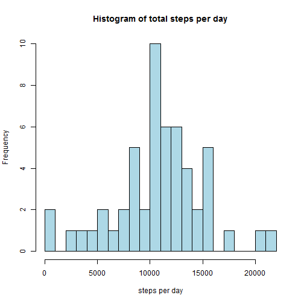
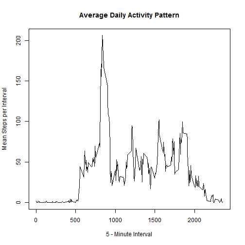
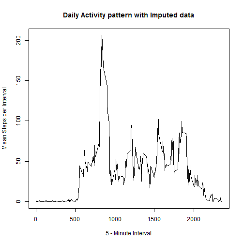
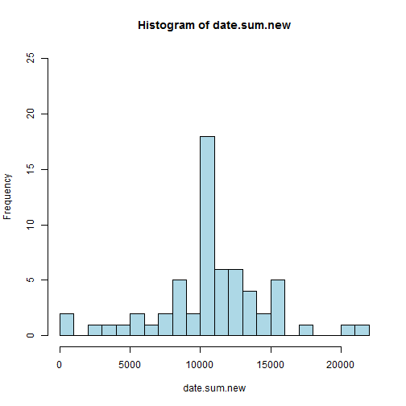
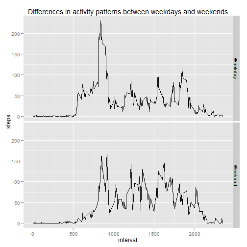

## Introduction

It is now possible to collect a large amount of data about personal movement using activity monitoring devices such as a Fitbit, Nike Fuelband, or Jawbone Up. These type of devices are part of the "quantified self" movement - a group of enthusiasts who take measurements about themselves regularly to improve their health, to find patterns in their behavior, or because they are tech geeks. But these data remain under-utilized both because the raw data are hard to obtain and there is a lack of statistical methods and software for processing and interpreting the data.

This assignment makes use of data from a personal activity monitoring device. This device collects data at 5 minute intervals through out the day. The data consists of two months of data from an anonymous individual collected during the months of October and November, 2012 and include the number of steps taken in 5 minute intervals each day.
Data

The data for this assignment can be downloaded from the course web site:

Dataset: [Activity monitoring data 52K](https://d396qusza40orc.cloudfront.net/repdata%2Fdata%2Factivity.zip)


The variables included in this dataset are:  

* **steps:** Number of steps taking in a 5-minute interval (missing values are coded as NA)
* **date:** The date on which the measurement was taken in YYYY-MM-DD format
* **interval:** Identifier for the 5-minute interval in which measurement was taken

The dataset is stored in a comma-separated-value (CSV) file and there are a total of 17,568 observations in this dataset.


### Loading and Preprocessing the data  


```r
### Set working directory
setwd("~/Statistik/Reproducible_Research/Reproducible-Research")
### Load data
activity <- read.csv("activity.csv")
str(activity)
```

```
## 'data.frame':	17568 obs. of  3 variables:
##  $ steps   : int  NA NA NA NA NA NA NA NA NA NA ...
##  $ date    : Factor w/ 61 levels "2012-10-01","2012-10-02",..: 1 1 1 1 1 1 1 1 1 1 ...
##  $ interval: int  0 5 10 15 20 25 30 35 40 45 ...
```

```r
activity$date <- as.POSIXct(activity$date)
summary(activity)
```

```
##      steps            date                        interval   
##  Min.   :  0.0   Min.   :2012-10-01 00:00:00   Min.   :   0  
##  1st Qu.:  0.0   1st Qu.:2012-10-16 00:00:00   1st Qu.: 589  
##  Median :  0.0   Median :2012-10-31 00:00:00   Median :1178  
##  Mean   : 37.4   Mean   :2012-10-30 23:32:27   Mean   :1178  
##  3rd Qu.: 12.0   3rd Qu.:2012-11-15 00:00:00   3rd Qu.:1766  
##  Max.   :806.0   Max.   :2012-11-30 00:00:00   Max.   :2355  
##  NA's   :2304
```

```r
zeroes <- sum(activity$steps==0, na.rm=T)/nrow(activity)*100
max(activity$interval)/60
```

```
## [1] 39.25
```

Preprocessing: The variable "date" of the activity dataset was transformed to class "time" with POSIXlt.  
               The variable "interval" was not transformed, due to lack of knowledge about which class                    
               would be the right one. Therfore i had to keep in mind that it was measured in minutes,
               hence the third number before the decimal separator will count the hour.
The dataset has 62.6935% zeroes within the "steps" variable. The Test person didn't move during more than half of the test period.

### What is mean total number of steps taken per day?

```r
date.sum <- with(activity, tapply(steps,date,sum))
hist(date.sum, col="light blue", breaks=30, main="Histogram of total steps per day", xlab="steps per day")
```

 

```r
date.mean <- mean(date.sum, na.rm=T)
date.median <- median(date.sum, na.rm=T)
summary(date.sum)
```

```
##    Min. 1st Qu.  Median    Mean 3rd Qu.    Max.    NA's 
##      41    8840   10800   10800   13300   21200       8
```

The mean number of steps taken per day was 1.0766 &times; 10<sup>4</sup> which is almost exactly the median number 10765. There were 8 days wihtout data. There was no day without movement.

### What is the average daily activity pattern?  

```r
interval.mean <- with(activity, tapply(steps,interval,mean, na.rm=T))
plot(activity$interval[1:288],interval.mean, type="l", main="Average Daily Activity Pattern",
     xlab="5 - Minute Interval", ylab="Mean Steps per Interval")
```

 

```r
interval.mean <- data.frame(int.mean=as.numeric(interval.mean), 
                            interval=rownames(interval.mean), 
                            row.names=c(1:288))
str(interval.mean)
```

```
## 'data.frame':	288 obs. of  2 variables:
##  $ int.mean: num  1.717 0.3396 0.1321 0.1509 0.0755 ...
##  $ interval: Factor w/ 288 levels "0","10","100",..: 1 226 2 73 136 195 198 209 212 223 ...
```

```r
summary(interval.mean)
```

```
##     int.mean         interval  
##  Min.   :  0.00   0      :  1  
##  1st Qu.:  2.49   10     :  1  
##  Median : 34.11   100    :  1  
##  Mean   : 37.38   1000   :  1  
##  3rd Qu.: 52.83   1005   :  1  
##  Max.   :206.17   1010   :  1  
##                   (Other):282
```

```r
which(interval.mean$int.mean==max(interval.mean$int.mean))
```

```
## [1] 104
```

```r
max.interval=interval.mean[104,2]
max.steps=interval.mean[104,1]

# Period with highest activity
interval.mean[which(interval.mean[,1]>=120),]
```

```
##     int.mean interval
## 99     129.4      810
## 100    157.5      815
## 101    171.2      820
## 102    155.4      825
## 103    177.3      830
## 104    206.2      835
## 105    195.9      840
## 106    179.6      845
## 107    183.4      850
## 108    167.0      855
## 109    143.5      900
## 110    124.0      905
```

```r
sum(which(interval.mean[,1]>=120))
```

```
## [1] 1254
```

```r
mean(which(interval.mean[,1]>=120))
```

```
## [1] 104.5
```

The Persons maximum interval regarding steps taken in average across all days was 835, i.e. 8:35 a.m., with 206.1698 on average.
The Person woke up at about 5:00 a.m. Between 8:10 p.m and 9:05 p.m. he took 104.5 steps in average. Probably he did Sports, whereby he reached maximum velocity in the middle of his morning exercise.

### Imputing missing values

```r
NA.counts <- length(activity[is.na(activity$steps),]$steps)

interval.mean <- with(activity, tapply(steps,interval,mean, na.rm=T))
interval.mean <- data.frame(interval.mean)

activity.new <- activity

# Fill in the mean number of steps for the 5-minute intervals corresponding to the Missing Values.
for (i in seq(0,2355,5)){
        activity.new[is.na(activity.new$steps)& activity.new$interval==i,]$steps <- interval.mean[row.names(interval.mean)==i,]
        }

interval.mean.new <- with(activity.new, tapply(steps,interval,mean, na.rm=T))
plot(activity.new$interval[1:288],interval.mean.new, type="l", main="Daily Activity pattern with Imputed data", xlab="5 - Minute Interval", ylab="Mean Steps per Interval")
```

 

```r
date.sum.new <- with(activity.new, tapply(steps,date,sum))
hist(date.sum.new, col="light blue", breaks=30, ylim=c(0,25))
```

 

```r
date.mean.new <- mean(date.sum.new, na.rm=T)
date.median.new <- median(date.sum.new, na.rm=T)
```

There are 2304 NAs in the steps column. Which is 13.1148% of the data. 
The maximum frequency of steps taken each day increased by 8. But only the bar in the middle changes. This bar designates the mean number of steps. Hence imputing the data led to 10 more days with mean Number of Steps. 
For the imputed dataset, the mean number of steps taken per day was 1.0766 &times; 10<sup>4</sup> which is almost exactly the median number 1.0766 &times; 10<sup>4</sup>. Not Surprisingly, these are almost exactly the same numbers as in the original dataset. The Impact of imputing NA's with numbers from interval averages on the average total number of steps taken daily is negligible.

### Are there differences in activity patterns between weekdays and weekends?

```r
activity.new$day <- weekdays(as.POSIXlt(activity.new$date))
require(plyr)
activity.new$day  <- revalue(activity.new$day, c(Montag="Weekday",
                                                 Dienstag="Weekday",
                                                 Mittwoch="Weekday",
                                                 Donnerstag="Weekday",
                                                 Freitag="Weekday",
                                                 Samstag="Weekend",
                                                 Sonntag="Weekend"))


activity.week <- with(activity.new, tapply(steps,interaction(day,interval, sep="_"),mean))
activity.week <- data.frame(activity.week)
activity.week$V1 <- rownames(activity.week)

require(reshape2)
activity.week <- cbind(with(activity.week, colsplit(V1,"_",c("day","interval"))),
                       steps=activity.week$activity.week)

require(ggplot2)
ggplot(activity.week, aes(x=interval, y=steps)) + geom_line()+facet_grid(day~.)+ggtitle("Differences in activity patterns between weekdays and weekends")
```

 

Obviously The Person sleeped longer at weekends and moved more frequently after 20:00 p.m.. Furthermore he didn't seem to do sports as intensively as during the week. But there is more movement in the afternoon, too.


```r
require(knitr)
#knit2html()
```


